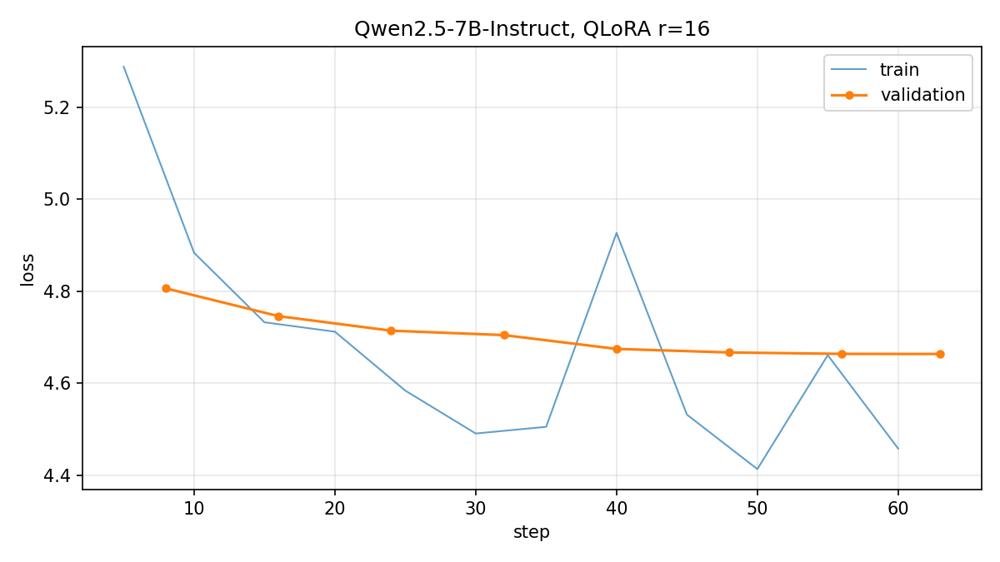

# QLoRA дообучение Qwen2.5-7B-Instruct на ответах врачей

[English version](README.md)

Задача: научить 7B instruct-модель отвечать пациенту так, как это делает врач на сайте
консультаций. Один абзац, сразу по делу, без буллетов и без дисклеймеров. Базовая
модель на тот же вопрос выдаёт структурированное эссе. Этот разрыв и есть то, что
убирается обучением, и именно его меряет оценка.

Всё работает на бесплатных GPU Kaggle: 27 минут обучения, адаптер весит 81 МБ.

- Базовая модель: `Qwen/Qwen2.5-7B-Instruct`
- Датасет: `lavita/ChatDoctor-HealthCareMagic-100k`
- Метод: QLoRA, база в 4 бита nf4, LoRA r=16 на attention и MLP
- Сохраняется только адаптер, 15 ГБ базовых весов остаются на Hub

## Результаты

Одна эпоха по 1000 обучающих примеров, 63 шага оптимизатора, 27 минут обучения на двух
Kaggle T4. Адаптер здесь это чекпойнт с наименьшим лоссом на валидации, в этом прогоне
он же последний.



Валидация падает с 4.806 до 4.663 и выполаживается, а не разворачивается вверх. Прогон
на три эпохи, который был первым, описан ниже в разделе про то, что не сработало.

| | база | база + адаптер |
|---|---|---|
| ROUGE-L F1 | 0.119 | **0.168** |
| BERTScore F1 (нормированный) | -0.037 | **0.125** |
| побед по ROUGE-L из 20 | 3 | **17** |
| слов в среднем | 303 | 75 |
| символов в среднем | 2049 | 436 |
| ответов с буллетами | 95% | 0% |
| ответов с жирным текстом | 95% | 0% |
| ответов с заголовком | 0% | 0% |
| ответов с дисклеймером | 60% | 20% |

Референсные ответы для сравнения: 102 слова, 0% с буллетами, 15% с дисклеймером.

Обе метрики выросли, и парный счёт показывает, что среднее тянет не один выброс:
адаптер выигрывает 17 примеров из 20. Стилевые маркеры сдвинулись сильнее, чем метрики.
Базовая модель открывает буллеты в 19 ответах из 20, дообученная ни в одном, при нуле у
референсов. Длина падает с 303 слов до 75 при среднем у врачей в 102, то есть адаптер
слегка перелетает в сторону лаконичности.

Читать метрики стоит именно в таком порядке. Рост ROUGE-L с 0.119 до 0.168 отчасти
обеспечен схлопыванием длины: эссе на 300 слов физически не может сильно пересечься с
абзацем на 100, каким бы хорошим оно ни было. Переход BERTScore из отрицательной зоны в
0.125 сигнал сильнее, поскольку после нормировки ноль это уровень схожести пары
несвязанных предложений. Честный вывод такой: регистр модель усвоила убедительно, и ни
одна из метрик не может сказать, стала ли она лучше разбираться в медицине.

### Один пример

**Пациент:** "i am having serious issues controling my bp. i take 10mg amlodopine, 40mg
lisinopril, 100mg antenolol and 2.5 mg bendrofluazide daily, i had it checked and it was
162/108 [...] and at 32 i am getting a bit fed up of this. any ides?"

**Базовая модель**, один из 20 ответов, и все с буллетами:

> It sounds like you're doing everything right in terms of lifestyle modifications,
> which is great. However, managing high blood pressure (hypertension) can sometimes be
> challenging despite these efforts. Here are some suggestions and considerations:
>
> 1. **Consult Your Doctor**: Given that your blood pressure remains high despite taking
> multiple medications, it would be wise to consult your healthcare provider [...]

**База с адаптером:**

> You are taking multiple medicines for hypertension. You should consult your doctor and
> get evaluated. You may need to change your medicines or increase the dose of your
> medicines. You can also get done 24 hours blood pressure monitoring to know about your
> blood pressure pattern. You should avoid stress and anxiety as these can increase your
> blood pressure.

**Настоящий ответ врача:**

> You will first evaluation for cause of blood pressure. You should undergo test like
> kidney function test, renal artery Doppler, Sr cortisol and 24 hr Urinary
> Metanephrines [...]

Регистр верный, конкретика нет. Референс называет анализы, дообученная модель
воспроизводит форму врачебного ответа вокруг более жидкого содержания. Этот разрыв и
есть честный предел переноса стиля на тысяче примеров.

## Почему этот датасет

ТЗ просит специфический стиль ответов, значит датасет должен отличаться от базовой
модели так, чтобы разницу было видно без микроскопа. HealthCareMagic подходит: это
настоящие ответы с сайта консультаций, написанные одним плотным абзацем, который
доходит до оценки состояния и не виляет. Задайте тот же вопрос Qwen2.5-7B-Instruct и
получите заголовки, буллеты, дифференциальный диагноз и финальную строчку с советом
обратиться к врачу. Два явно разных регистра, поэтому и обучающий сигнал, и оценка
читаются однозначно.

Колонка `instruction` не несёт информации. Это одно и то же предложение во всех 112 165
строках, поэтому оно вынесено в `src/prompt.py` как системный промпт вместо того, чтобы
повторяться внутри каждого примера:

> If you are a doctor, please answer the medical questions based on the patient's
> description.

## Данные

`src/explore.py` это разовый прогон по сырому корпусу, который и задал пороги фильтров.
Он лежит в репозитории, чтобы числа ниже можно было перепроверить, а не принимать на
веру. Что он показал: ответы собраны скрапером и испорчены двумя разными способами.
Шаблонный мусор, который добавил скрапер, чинится. Подстановка слов внутри медицинского
текста не чинится.

```
"Chat Doctor" посреди предложения                       36 248 строк
ответы без завершающей пунктуации, обрезанные на полуслове  21 286 строк
"Phoenix nerve" вместо phrenic nerve, "Cellophane You" вместо Thank You
```

Вторая семья это причина, по которой пайплайн выбрасывает строки, а не латает их.
Подстановка, попавшая в медицинский термин, даёт гладкий, уверенный и неверный текст, и
поймать это без медицинского лексикона нечем. Всё, что несёт маркер такой порчи,
удаляется.

`src/clean.py` содержит по одному правилу починки на каждую семью шума,
`src/prepare_data.py` прогоняет воронку и пишет сплиты. Сначала по всем 112 тысячам
строк идут дешёвые построчные правила, затем берётся пул на 6000 с фиксированным сидом,
и уже внутри него работает проход по near-duplicate за O(n^2). Тот же проход по всему
корпусу это 112k на 112k сравнений ради примерно 0.2% строк.

```
stage                                   kept   dropped
------------------------------------------------------
loaded                                112165
exact duplicate question              111964       201
'Chat Doctor' left mid-answer          75716     36248
corrupted opening word                 71972      3744
'.*' corruption marker                 71543       429
markdown or enumerated list            67178      4365
answer starts mid-word                 57282      9896
answer cut off mid-sentence            35996     21286
length outside bounds                  34566      1430
sampled candidate pool (seed 42)        6000     28566
near-duplicate question (cos>=0.85)     6000
```

Near-duplicate внутри пула не нашёл ничего, и это ожидаемый исход после снятия точных
дублей на настолько разреженном корпусе. В пайплайне он остаётся, потому что на размере
пула стоит копейки, а ТЗ его просит.

Из 112 165 строк выживают 34 566. Сплиты: 1000 на обучение, 100 на валидацию, 20 в
отложенную выборку, всё с сидом 42, формат JSONL с полями `instruction` и `response`.
Десять случайных обучающих строк отрендерены в `reports/sample_train.md` для ручного
просмотра, потому что таблица воронки ничего не говорит о том, хорош ли выживший текст.

Обучение на 1000 строк из 34 566 сделано намеренно. Перенос стиля такого рода выходит на
плато рано, а меньший набор покупает три эпохи внутри одной бесплатной GPU-сессии с
запасом на одну неудачную попытку.

## Обучение

`src/train_lora.py`. Конфигурацию в основном диктует карта: T4 это compute capability
7.5, значит ни bf16, ни flash-attention. Отсюда fp16 везде, fp16 как вычислительный тип
для 4-битной базы и sdpa как бэкенд внимания.

| | |
|---|---|
| квантизация | nf4, double quant, вычисления в fp16 |
| LoRA | r=16, alpha=32, dropout 0.05 |
| целевые модули | q,k,v,o + gate,up,down |
| длина последовательности | 640 (самый длинный очищенный пример 524 токена) |
| батч | 2 на устройство, 2 карты, 4 накопления, эффективный 16 |
| оптимизатор | paged AdamW 8-bit, lr 2e-4, cosine, warmup 3% |
| эпохи | 1, 63 шага оптимизатора, лучший чекпойнт по валидации |
| прочее | gradient checkpointing, max grad norm 0.3, адаптер сохранён в fp16 |

Два решения, которые стоит защищать отдельно.

**Лосс считается только по ответу.** Токены промпта в `src/sft_data.py` выставлены в
-100. Без этой маски модель тратит половину ёмкости на воспроизведение жалоб пациента,
а это не задача.

**LoRA цепляется и к MLP, не только к attention.** Адаптеры только на внимании обучаются
быстрее и хуже адаптируют стиль. Многословность, которую мы убираем, живёт в
feed-forward блоках, поэтому они включены.

Промпт и ответ токенизируются раздельно, а не так, что токенизируется весь диалог и
потом режется. Чат-шаблон умеет склеивать токены через границу, и ошибка на единицу
здесь молча сдвигает всю маску лейблов.

## Оценка

`src/generate.py` отвечает на 20 отложенных вопросов дважды, `src/metrics.py` считает
обе колонки против настоящего ответа врача.

Обе колонки снимаются с одной загруженной модели. Адаптер цепляется один раз и
отключается на базовом проходе через `disable_adapter()`, поэтому сравнение идёт ровно с
теми весами, на которых адаптер и сидит, с одинаковой 4-битной квантизацией с обеих
сторон. Если грузить неквантизованную базу отдельно, квантизация стала бы вторым
отличием между колонками. Декодирование жадное: сэмплирование добавило бы шум прогона к
сравнению на двадцати примерах.

Метрик три группы, потому что ни одна поодиночке вопрос не закрывает.

**ROUGE-L** это лексическое пересечение с референсом. На свободном медицинском тексте
это слабый прокси, поскольку два верных ответа могут не совпасть почти нигде. Он
приводится, потому что ТЗ просит стандартную метрику и потому что крупный сдвиг в нём
всё же информативен. Рядом со средним стоит парный счёт побед, так как среднее по
двадцати примерам может вытянуть один выброс.

**BERTScore** это пересечение в пространстве эмбеддингов, менее чувствительное к
перефразировке, с нормировкой на базовую линию пакета. Без нормировки все значения
липнут к 0.85 и разница не видна.

**Стилевые маркеры** это длина, буллеты, жирный текст, заголовки и дисклеймеры. Именно
на это был нацелен файнтюн, поэтому оно меряется напрямую, а не выводится боком из
метрики, которая видит стиль краем глаза. Референсные ответы считаются по тем же
маркерам, чтобы было видно, к какому полюсу ближе каждая колонка.

## Как запустить

```bash
pip install -r requirements-data.txt
python src/prepare_data.py                 # пишет data/*.jsonl и data/funnel.txt

# обучению нужен GPU, см. notebooks/kaggle_train.ipynb или notebooks/colab_train.ipynb
PYTHONPATH=src python src/train_lora.py --out adapter

pip install -r requirements-eval.txt
PYTHONPATH=src python src/generate.py --adapter adapter   # нужен GPU
python src/metrics.py                                     # CPU, около минуты
```

Ноутбуки намеренно тонкие: они только оркестрируют, а код, который они вызывают, это тот
же код из `src/`.

## Что не сработало

**Три эпохи это на две больше нужного.** Первый прогон шёл 3 эпохи, 189 шагов. Лосс на
обучении упал с 5.6 до 3.5, а валидация достигла минимума 4.663 около шага 50 и дальше
поднялась до 4.831. Сохранялся только финальный адаптер, поэтому тот прогон выдал
собственный худший чекпойнт. Картинка лежит в `reports/loss_curve_3epochs.png`.
Исправление это флаг `--load-best`: валидация каждые 8 шагов и восстановление лучшего
чекпойнта в конце. Одна эпоха выходит на тот же минимум валидации и на нём
останавливается.

**Арифметика шагов ошибалась вдвое.** Kaggle выдаёт две T4, и Trainer задействует обе,
поэтому батч 2 на устройство с 4 шагами накопления это эффективный батч 16, а не 8, как
считала арифметика для одной карты. Первый прогон занял 189 шагов там, где ноутбук
обещал 375. Теперь оценка умножается на число видимых устройств, и скрипт печатает то,
что у него получилось, до начала обучения.

**Датасет Kaggle, который ещё обрабатывается, монтируется как ничто.** Первое ядро было
запущено через секунды после создания датасета с кодом, поэтому `/kaggle/input` оказался
пустым. Поскольку `!python missing_file.py` внутри ноутбука не бросает исключение,
прогон спокойно проскочил обе обучающие ячейки и упал через 40 минут на построении
графика, потратив GPU-сессию впустую. Теперь ячейка стейджинга печатает содержимое
монтирования, проверяет его ассертами и ищет код по имени файла, а не по пути:
настоящая точка монтирования это `/kaggle/input/datasets/<owner>/<slug>`, а не
`/kaggle/input/<slug>` из документации.

**Удаление near-duplicate не принесло ни одной строки.** Косинус по символьным n-граммам
с порогом 0.85 выбросил 0 строк из 6000 в пуле, потому что снятие точных дублей уже
забрало те 201, которые стоило забрать. В пайплайне он остаётся, раз на размере пула
ничего не стоит, но здесь об этом сказано прямо, а не подано так, будто он отработал.

**W&B пишет офлайн.** Живое логирование требует API-ключа внутри ядра, а единственный
способ занести его на Kaggle без ключа в коде это секрет, создаваемый через веб-интерфейс.
Прогон логируется офлайн в `wandb/` и превращается в обычный run командой
`wandb sync wandb/offline-run-*`.

## Ограничения

Описанная выше порча подстановкой слов ловится только тогда, когда она оставляет
узнаваемый маркер. Строки, где подстановка легла чисто, остались в обучающих данных,
поэтому модель учится в том числе на тихо неверном медицинском тексте. Это свойство
корпуса, а не то, что можно починить фильтрами.

Двадцать отложенных примеров это то, что просит ТЗ, и этого хватает, чтобы увидеть смену
стиля, но мало, чтобы разделить две близкие модели по ROUGE. Парный счёт побед приводится
именно поэтому и читать его надо как направление, а не как измерение.

Ничто здесь не является медицинской рекомендацией, и файнтюн делает модель увереннее по
тону, а не правильнее по сути. Учить модель выбрасывать дисклеймеры это законное
стилевое упражнение и плохая идея в проде.
